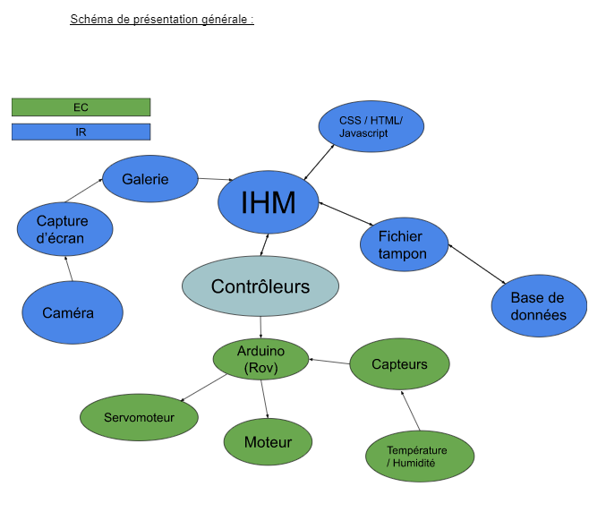
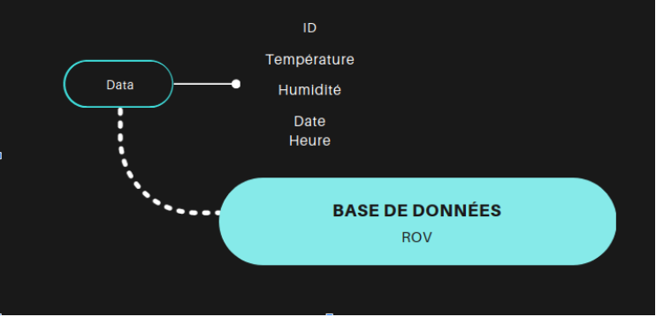

# Mini-projet Rov 2023

## Présentation du projet

Ce projet à été réalisé par deux étudiants de première année de BTS Systèmes Numériques. Un étudiant dans la filière Informatique et Réseaux (IR) et un autre étudiant dans la filière Electronique et Communication (EC).

Le projet est de créer un robot capable de se déplacer dans milieu hostile (contaminé) afin de réaliser des mesures et des prises de vues. Le robot sera muni d’un câble, utilisé comme fil d’Ariane pour récupérer le robot en cas de panne ou de dysfonctionnement dans l’enceinte contaminée.

## Objectifs

### Partie EC (Electronique et Communication)

- Communiquer via une liaison série avec une application logiciel web
- Gestion des capteurs
- Cablage
- Gestion des alimentations
- Installation de systèmes embarqués

### Partie IR (Informatique et Réseaux)

- Communiquer via une liaison série avec un système embarqué
- Création d'une IHM (Interface Homme Machine)
- Création / Intéractiobn avec une base de données
- Modélisation / Réception d'une trame

## Fonctionnalités

### Interface Homme Machine

Dans la page principale, on peut retrouver un tableau affichant les données stockées dans la base de données.

Un menu permet d'accéder à la l'interface caméra.

### Interface caméra

Rendu en direct de la caméra branchée en série

Bouton permettant de prendre une capture d'écran

### Galerie photos

Une galerie permettant d'afficher les captures prises

Les captures sont enregistrées dans un dossier

### Base de données

Les trames reçues sont insérées dans la base de données. Puis une fois insérée, les données vont être affichées dans un tableau.

Voici un schéma explicatif de la structure de la base de données :

## Technologies utilisées

- PHP
- CSS
- Javascript
- C++

---
©️ LaSalle Avignon - 2023
